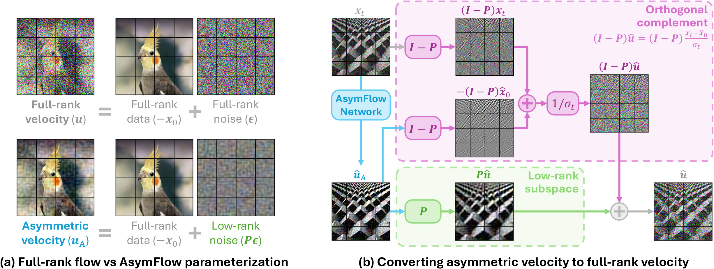
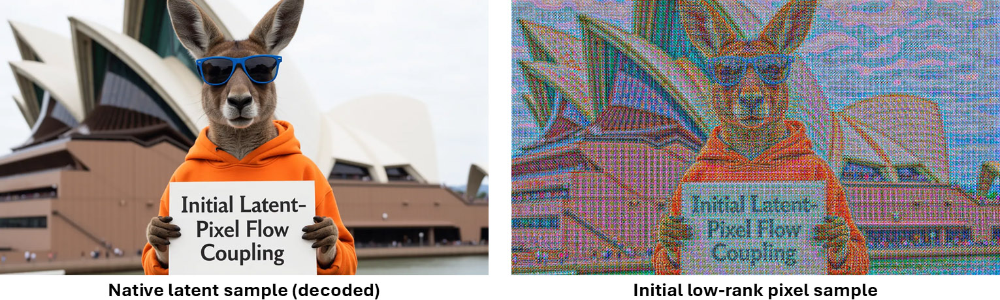
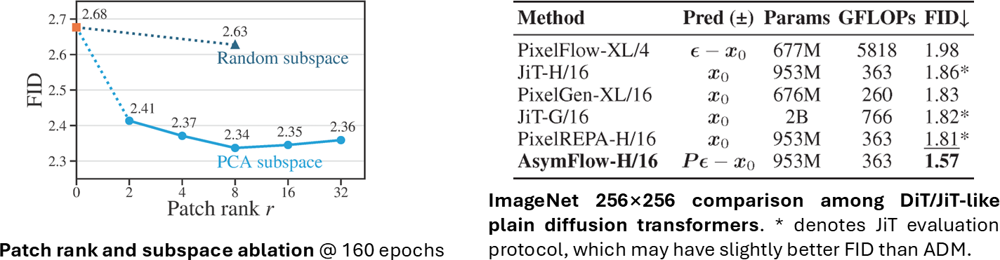
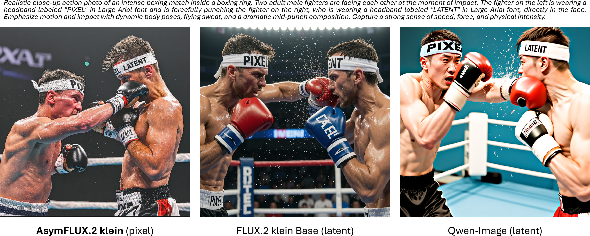
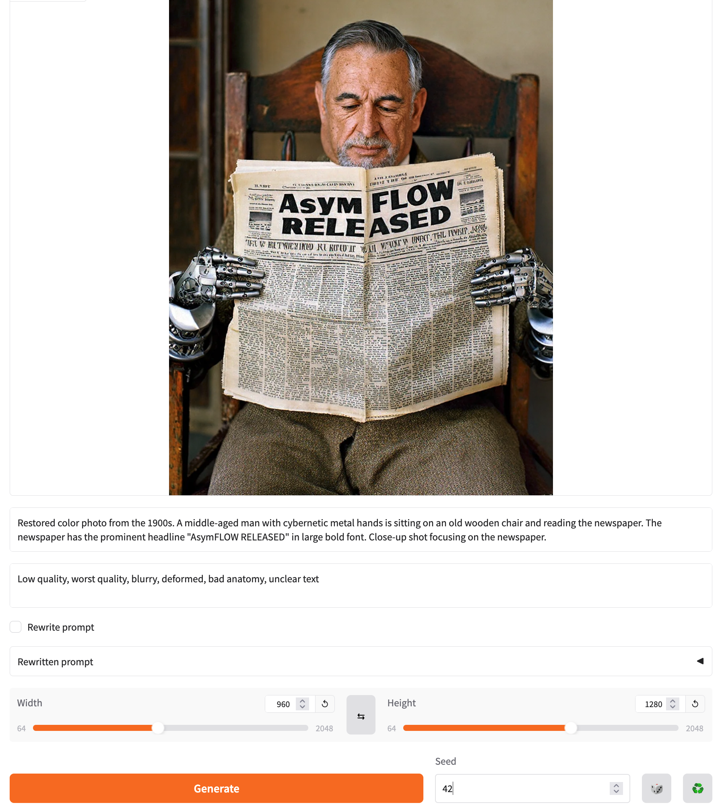

# AsymFlow: Asymmetric Flow Models

Official PyTorch implementation of the paper:

**Asymmetric Flow Models**
    <br>
    arXiv 2026
    <br>
    [Hansheng Chen](https://lakonik.github.io/),
    [Jan Ackermann](https://janackermann.info/),
    [Minseo Kim](https://soniaminseokim.github.io/),
    [Gordon Wetzstein](http://web.stanford.edu/~gordonwz/), 
    [Leonidas Guibas](https://geometry.stanford.edu/?member=guibas)<br>
    Stanford University
    <br>
    [Project Page](https://hanshengchen.com/asymflow) | [arXiv](https://arxiv.org/abs/2605.12964) | [ComfyUI (coming soon)]() | [AsymFLUX.2 klein Demo🤗](https://huggingface.co/spaces/Lakonik/AsymFLUX.2-klein)


## Highlights

- **Rank-asymmetric flow parameterization**: AsymFlow networks predict the *Asymmetric Velocity* $`u_\mathrm{A}=P\epsilon - x_0`$, which keeps the data $`x_0`$ full-dimensional while restricting the noise $`\epsilon`$ to a low-rank subspace. The full-dimensional velocity is recovered analytically for flow matching training and sampling.

  

- **Finetuning latent models into pixel models**: AsymFlow enables the first-ever latent-to-pixel finetuning for large pretrained latent diffusion models. This is achieved by aligning the pretrained latent space with a low-rank pixel patch subspace, giving a seamless pixel-space initialization.

  

- **State-of-the-art ImageNet pixel diffusion**: On ImageNet 256x256, rank-8 AsymFlow achieves 1.76 FID with the JiT-H/16 network and 1.57 FID with an additional REPA loss, outperforming prior DiT/JiT-like pixel diffusion models by a large margin. 

  

- **Photorealistic pixel-space text-to-image generation**: Finetuned from FLUX.2 klein 9B, the AsymFLUX.2 klein pixel model produces highly realistic images with rich visual styles and fine detail, beating its latent base on benchmarks including HPSv3, DPG-Bench, and GenEval.

  

## Installation

Follow the instructions in the [root README](../README.md#installation) to set up the environment and install LakonLab.

## Inference: Diffusers Pipeline

We provide a Diffusers-style pipeline for AsymFLUX.2 klein. The [example](../demo/example_asymflux2_klein_pipeline.py) below loads the FLUX.2 klein Base 9B model, attaches the AsymFlow adapter, and generates an image directly in pixel space.

```python
import math
import torch
from lakonlab.models.architectures import OklabColorEncoder
from lakonlab.models.diffusions.schedulers import FlowAdapterScheduler
from lakonlab.pipelines.pipeline_pixelflux2_klein import PixelFlux2KleinPipeline

pipe = PixelFlux2KleinPipeline.from_pretrained(
    'black-forest-labs/FLUX.2-klein-base-9B',
    vae=OklabColorEncoder(
        use_affine_norm=True,
        mean=(0.56, 0.0, 0.01),
        std=0.16),
    scheduler=FlowAdapterScheduler(
        shift=17.0,
        use_dynamic_shifting=True,
        base_seq_len=1024 ** 2,
        max_seq_len=2048 ** 2,
        base_logshift=math.log(17.0),
        max_logshift=math.log(34.0),
        dynamic_shifting_type='sqrt',
        base_scheduler='UniPCMultistep'),
    torch_dtype=torch.bfloat16)
adapter_name = pipe.load_lakonlab_adapter(  # you may later call `pipe.set_adapters([adapter_name, ...])` to combine other adapters (e.g., style LoRAs)
    'Lakonik/AsymFLUX.2-klein-9B',
    target_module_name='transformer')
pipe = pipe.to('cuda')

# Text-to-image generation example
prompt = 'Restored color photo from the 1900s. A middle-aged man with cybernetic metal hands is sitting on an old wooden chair and reading the newspaper. The newspaper has the prominent headline "AsymFLOW RELEASED" in large bold font. Close-up shot focusing on the newspaper.'
neg_prompt = 'Low quality, worst quality, blurry, deformed, bad anatomy, unclear text'
out = pipe(
    prompt=prompt,
    negative_prompt=neg_prompt,
    width=960,
    height=1280,
    num_inference_steps=38,
    guidance_scale=4.0,
    generator=torch.Generator().manual_seed(42),
).images[0]
out.save('asymflux2_klein.png')
```


## Inference: Gradio App

We provide a Gradio app for local interactive inference with AsymFLUX.2 klein. The public demo is available at [AsymFLUX.2 klein Demo](https://huggingface.co/spaces/Lakonik/AsymFLUX.2-klein).

Run the following command to launch the app locally:

```bash
python demo/gradio_asymflux2_klein.py --share
```



## Training and Evaluation

### ImageNet Training

Before training, Download [ILSVRC2012_img_train.tar](https://www.image-net.org/challenges/LSVRC/2012/2012-downloads.php) and the [metadata](http://dl.caffe.berkeleyvision.org/caffe_ilsvrc12.tar.gz). Extract the downloaded archives according to the following folder tree (or use symlinks).
```
./
├── configs/
├── data/
│   └── imagenet/
│       ├── train/
│       │   ├── n01440764/
│       │   │   ├── n01440764_10026.JPEG
│       │   │   ├── n01440764_10027.JPEG
│       │   │   …
│       │   ├── n01443537/
│       │   …
│       ├── imagenet1000_clsidx_to_labels.txt
│       ├── train.txt
|       …
├── lakonlab/
├── tools/
…
```

Run the following command to precompute the PCA subspace:
```bash
python tools/asymflow_subspace_pca_dit.py configs/asymflow/asymflow_h_16_r8_imagenet_16gpus.py
```

Then, run the following command to train the model using DDP on 1 node with 8 GPUs:
```bash
torchrun --nnodes=1 --nproc_per_node=8 tools/train.py <PATH_TO_CONFIG> --launcher pytorch --diff_seed
```
where `<PATH_TO_CONFIG>` can be one of the following:
- `configs/asymflow/asymflow_h_16_r8_imagenet_8gpus.py` (FM loss only)
- `configs/asymflow/asymflow_h_16_r8_repa_imagenet_8gpus.py` (FM + REPA loss)

The above configs specify a training batch size of 128 images per GPU, so 8 GPUs are required to reproduce the total batch size of 1024 in the JiT training setup. If you do not have enough VRAM, reduce the batch size (`samples_per_gpu`) in the config file accordingly, or enable gradient accumulation by adding `grad_accum_batch_size=<DESIRED_BATCH_SIZE>` to `train_cfg` in the config file.

### ImageNet Evaluation (ADM evaluation protocol)

Run the following command to evaluate a pretrained model (downloaded automatically) using DDP on 1 node with 8 GPUs:
```bash
torchrun --nnodes=1 --nproc_per_node=8 tools/test.py <PATH_TO_CONFIG> --launcher pytorch --diff_seed
```
where `<PATH_TO_CONFIG>` can be one of the following:
- `configs/asymflow/asymflow_h_16_r8_imagenet_test.py` (FM loss only)
- `configs/asymflow/asymflow_h_16_r8_repa_imagenet_test.py` (FM + REPA loss)

To evaluate a custom checkpoint, add the `--ckpt <PATH_TO_CKPT>` argument:
```bash
torchrun --nnodes=1 --nproc_per_node=8 tools/test.py <PATH_TO_CONFIG> --ckpt <PATH_TO_CKPT> --launcher pytorch --diff_seed
```

### AsymFLUX.2 klein Training

Instructions on data preparation will be added soon. Please refer to the [config](../configs/asymflow/asymflux2_klein_32gpus.py) for training details.

### AsymFLUX.2 klein Evaluation (HPSv3, DPG-Bench, GenEval)

Run the following command to evaluate the pretrained AsymFLUX.2 klein (downloaded automatically) using DDP on 1 node with 8 GPUs:
```bash
torchrun --nnodes=1 --nproc_per_node=8 tools/test.py configs/asymflow/asymflux2_klein_test.py --launcher pytorch --diff_seed
```
This will export the generated images and metadata to `viz/asymflux2_klein_test/`, which can be processed by the [HPSv3 Benchmark](https://github.com/MizzenAI/HPSv3), [DPG-Bench](https://github.com/TencentQQGYLab/ELLA) and [GenEval](https://github.com/djghosh13/geneval) evaluation scripts. 

To evaluate a custom checkpoint instead of the official model, we provide two options.

*Option A.*

Run the export script to convert the checkpoint to diffusers safetensors:
```bash
python tools/export_asymflow_to_diffusers.py <PATH_TO_CONFIG> --ckpt <PATH_TO_CKPT> --out-dir <OUTPUT_DIR>
```
Then, modify the test config file to set `pretrained_adapter` to `<OUTPUT_DIR>/diffusion_pytorch_model.safetensors`. Finally, run the evaluation command as above.

*Option B.*

Copy the `use_lora`, `lora_target_modules`, and `lora_rank` settings from the train config file to the test config file, and then run the evaluation command with an additional `--ckpt <PATH_TO_CKPT>` argument:
```bash
torchrun --nnodes=1 --nproc_per_node=8 tools/test.py <PATH_TO_CONFIG> --ckpt <PATH_TO_CKPT> --launcher pytorch --diff_seed
```

## Essential Code

- Subspace precomputation
    - [asymflow_subspace_pca_dit.py](../tools/asymflow_subspace_pca_dit.py): Create a patch PCA subspace for pixel AsymFlow models using DiT patch convention (channel last).
    - [asymflow_subspace_procrustes.py](../tools/asymflow_subspace_procrustes.py): Create a Procrustes latent-to-pixel subspace for pixel AsymFlow finetuning.
- Modeling
    - [asymjit.py](../lakonlab/models/architectures/asymflow/asymjit.py): AsymFlow wrapper for JiT architecture.
    - [asymflux2.py](../lakonlab/models/architectures/asymflow/asymflux2.py): AsymFlow wrapper and initialization utilities for FLUX.2 architecture.
    - [common.py](../lakonlab/models/architectures/asymflow/common.py): Shared AsymFlow utilities.
- Finetuning
    - [asymflow.py](../lakonlab/models/diffusions/asymflow.py): The `forward_train` method contains the finetuning loss with variance reduction and perceptual correction.
- Inference
    - [pipeline_pixelflux2_klein.py](../lakonlab/pipelines/pipeline_pixelflux2_klein.py): Full sampling code in the style of Diffusers.

## Citation
```
@article{asymflow,
  title={Asymmetric Flow Models},
  author={Hansheng Chen and Jan Ackermann and Minseo Kim and Gordon Wetzstein and Leonidas Guibas},
  url={https://arxiv.org/abs/2605.12964},
  journal={arXiv preprint arXiv:2605.12964},
  year={2026},
}
```
