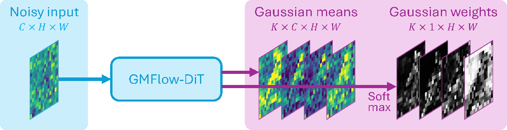
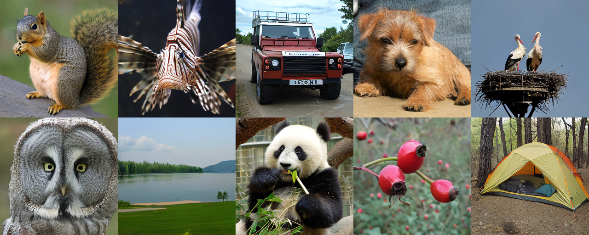
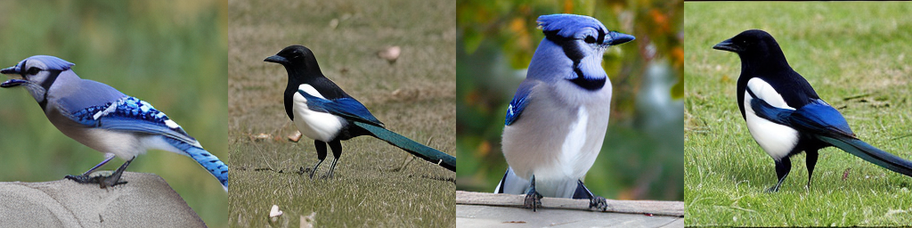

# Gaussian Mixture Flow Matching Models (GMFlow)

Official PyTorch implementation of the paper:

**Gaussian Mixture Flow Matching Models [[arXiv](https://arxiv.org/abs/2504.05304)]**
<br>
In ICML 2025
<br>
[Hansheng Chen](https://lakonik.github.io/)<sup>1</sup>, 
[Kai Zhang](https://kai-46.github.io/website/)<sup>2</sup>,
[Hao Tan](https://research.adobe.com/person/hao-tan/)<sup>2</sup>,
[Zexiang Xu](https://zexiangxu.github.io/)<sup>3</sup>, 
[Fujun Luan](https://research.adobe.com/person/fujun/)<sup>2</sup>,
[Leonidas Guibas](https://geometry.stanford.edu/?member=guibas)<sup>1</sup>,
[Gordon Wetzstein](http://web.stanford.edu/~gordonwz/)<sup>1</sup>, 
[Sai Bi](https://sai-bi.github.io/)<sup>2</sup><br>
<sup>1</sup>Stanford University, <sup>2</sup>Adobe Research, <sup>3</sup>Hillbot
<br>




## Highlights

GMFlow is an extension of diffusion/flow matching models.

- **Gaussian Mixture Output**: GMFlow expands the network's output layer to predict a Gaussian mixture (GM) distribution of flow velocity. Standard diffusion/flow matching models are special cases of GMFlow with a single Gaussian component.

- **Precise Few-Step Sampling**: GMFlow introduces novel **GM-SDE** and **GM-ODE** solvers that leverage analytic denoising distributions and velocity fields for precise few-step sampling.

- **Improved Classifier-Free Guidance (CFG)**: GMFlow introduces a **probabilistic guidance** scheme that mitigates the over-saturation issues of CFG and improves image generation quality.

- **Efficiency**: GMFlow maintains similar training and inference costs to standard diffusion/flow matching models.

## Installation

Follow the instructions in the [root README](../README.md#installation) to set up the environment and install LakonLab. In addition, if you would like to use the GM-SDE solver, please also install CUDA Toolkit 11.8+, which is required by the [gmflow_ops](../lakonlab/ops/gmflow_ops) CUDA extension (compiled automatically when running for the first time).

## GM-DiT ImageNet 256x256

### Inference

We provide a [Diffusers pipeline](../lakonlab/pipelines/pipeline_gmdit.py) for easy inference. The following code demonstrates how to sample images from the pretrained GM-DiT model using the GM-ODE 2 solver and the GM-SDE 2 solver.

```python
import json
import torch
from pathlib import Path
from huggingface_hub import snapshot_download
from lakonlab.models.diffusions.schedulers import FlowEulerODEScheduler, FlowSDEScheduler
from lakonlab.pipelines.pipeline_gmdit import GMDiTPipeline

# Download HF repo
ckpt = snapshot_download(repo_id='Lakonik/gmflow_imagenet_k8_ema')
# Fix the library path for the new LakonLab package structure
index_path = Path(ckpt) / 'model_index.json'
index_dict = json.loads(index_path.read_text(encoding="utf-8"))
index_dict["spectrum_net"][0] = "lakonlab.models.architectures.gmflow.spectrum_mlp"
index_dict["transformer"][0] = "lakonlab.models.architectures.gmflow.gmdit"
index_dict["scheduler"][0] = "lakonlab.models.diffusions.schedulers.flow_euler_ode"
index_path.write_text(json.dumps(index_dict, ensure_ascii=False, indent=2) + "\n", encoding="utf-8")
# Load the local repo
pipe = GMDiTPipeline.from_pretrained(ckpt, variant='bf16', torch_dtype=torch.bfloat16)
pipe = pipe.to('cuda')

# Pick words that exist in ImageNet
words = ['jay', 'magpie']
class_ids = pipe.get_label_ids(words)

# Sample using GM-ODE 2 solver
pipe.scheduler = FlowEulerODEScheduler.from_config(pipe.scheduler.config)
generator = torch.manual_seed(42)
output = pipe(
    class_labels=class_ids,
    guidance_scale=0.45,
    num_inference_steps=32,
    num_inference_substeps=4,
    output_mode='mean',
    order=2,
    generator=generator)
for i, (word, image) in enumerate(zip(words, output.images)):
    image.save(f'{i:03d}_{word}_gmode2_step32.png')

# Sample using GM-SDE 2 solver (the first run may be slow due to CUDA compilation)
pipe.scheduler = FlowSDEScheduler.from_config(pipe.scheduler.config)
generator = torch.manual_seed(42)
output = pipe(
    class_labels=class_ids,
    guidance_scale=0.45,
    num_inference_steps=32,
    num_inference_substeps=1,
    output_mode='sample',
    order=2,
    generator=generator)
for i, (word, image) in enumerate(zip(words, output.images)):
    image.save(f'{i:03d}_{word}_gmsde2_step32.png')
```

The results will be saved under the current directory.



### Before Training: Data Preparation

Download [ILSVRC2012_img_train.tar](https://www.image-net.org/challenges/LSVRC/2012/2012-downloads.php) and the [metadata](http://dl.caffe.berkeleyvision.org/caffe_ilsvrc12.tar.gz). Extract the downloaded archives according to the following folder tree (or use symlinks).
```
./
├── configs/
├── data/
│   └── imagenet/
│       ├── train/
│       │   ├── n01440764/
│       │   │   ├── n01440764_10026.JPEG
│       │   │   ├── n01440764_10027.JPEG
│       │   │   …
│       │   ├── n01443537/
│       │   …
│       ├── imagenet1000_clsidx_to_labels.txt
│       ├── train.txt
|       …
├── lakonlab/
├── tools/
…
```

Run the following command to prepare the ImageNet dataset using DDP on 1 node with 8 GPUs

```bash
torchrun --nnodes=1 --nproc_per_node=8 tools/cache_imagenet_data_sdvae.py
```

### Training

Run the following command to train the model using DDP on 1 node with 8 GPUs:

```bash
torchrun --nnodes=1 --nproc_per_node=8 tools/train.py configs/gmflow/gmdit_k8_imagenet_8gpus.py --launcher pytorch --diff_seed
```

Alternatively, you can start single-node DDP training from a Python script:

```bash
python train.py configs/gmflow/gmdit_k8_imagenet_8gpus.py --gpu-ids 0 1 2 3 4 5 6 7
```

The config in [gmdit_k8_imagenet_8gpus.py](../configs/gmflow/gmdit_k8_imagenet_8gpus.py) specifies a training batch size of 512 images per GPU and an inference batch size of 125 images per GPU. Training requires 32GB of VRAM per GPU, and the validation step requires an additional 8GB of VRAM per GPU. If you are using 32GB GPUs, you can disable the validation step by adding the `--no-validate` flag to the training command. Alternatively, you can also edit the config file to adjust the batch sizes.

By default, checkpoints will be saved into [checkpoints/](../checkpoints/), logs will be saved into [work_dirs/](../work_dirs/), and sampled images will be saved into [viz/](../viz/).

#### Resuming Training

If existing checkpoints are found, the training will automatically resume from the latest checkpoint.

#### Tensorboard

The logs can be plotted using Tensorboard. Run the following command to start Tensorboard:

```bash
tensorboard --logdir work_dirs/
```

### Evaluation

After training, to conduct a complete evaluation of the model under varying guidance scales, run the following command to start DDP evaluation on 1 node with 8 GPUs:

```bash
torchrun --nnodes=1 --nproc_per_node=8 tools/test.py configs/gmflow/gmdit_k8_imagenet_test.py --ckpt checkpoints/gmdit_k8_imagenet_8gpus/latest.pth --launcher pytorch --diff_seed
```

Alternatively, you can start single-node DDP evaluation from a Python script:
```bash
python test.py configs/gmflow/gmdit_k8_imagenet_test.py --ckpt checkpoints/gmdit_k8_imagenet_8gpus/latest.pth --gpu-ids 0 1 2 3 4 5 6 7
```

The config in [gmdit_k8_imagenet_test.py](../configs/gmflow/gmdit_k8_imagenet_test.py) specifies an inference batch size of 125 images per GPU, which requires 35GB of VRAM per GPU. You can edit the config file to adjust the batch size.

The evaluation results will be saved to where the checkpoint is located, and the sampled images will be saved into [viz/](viz/).

## Toy Model on 2D Checkerboard

We provide a minimal GMFlow trainer in [train_gmflow_toymodel.py](../demo/train_gmflow_toymodel.py) for the toy model on the 2D checkerboard dataset. Run the following command to train the model:

```bash
python demo/train_gmflow_toymodel.py -k 64
```

This minimal trainer does not support transition loss and EMA. To reproduce the results in the paper, you can use the following command to start the full trainer:

```bash
python train.py configs/gmflow/gmmlp_k64_checkerboard.py --gpu-ids 0
```

This full trainer is not optimized for the simple 2D checkerboard dataset, so GPU usage may be inefficient.

## Essential Code

- Training
    - [train_gmflow_toymodel.py](../demo/train_gmflow_toymodel.py): A simplified training script for the 2D checkerboard experiment.
    - [gmflow.py](../lakonlab/models/diffusions/gmflow.py): The `forward_train` method contains the full training loop.
- Inference
    - [pipeline_gmdit.py](../lakonlab/pipelines/pipeline_gmdit.py): Full sampling code in the style of Diffusers.
    - [gmflow.py](../lakonlab/models/diffusions/gmflow.py): The `forward_test` method contains the same full sampling loop.
- Networks
    - [gmdit.py](../lakonlab/models/architectures/gmflow/gmdit.py): GMDiT
    - [spectrum_mlp.py](../lakonlab/models/architectures/gmflow/spectrum_mlp.py): SpectrumMLP
    - [toymodels.py](../lakonlab/models/architectures/gmflow/toymodels.py): MLP toy model for the 2D checkerboard experiment.
- GM math operations
    - [gmflow_ops](../lakonlab/ops/gmflow_ops/): A complete library of analytic operations for GM and Gaussian distributions.

## Citation
```
@article{gmflow,
  title={Gaussian Mixture Flow Matching Models},
  author={Hansheng Chen and Kai Zhang and Hao Tan and Zexiang Xu and Fujun Luan and Leonidas Guibas and Gordon Wetzstein and Sai Bi},
  url={https://arxiv.org/abs/2504.05304}, 
  journal={arXiv preprint arXiv:2504.05304},
  year={2025},
}
```
