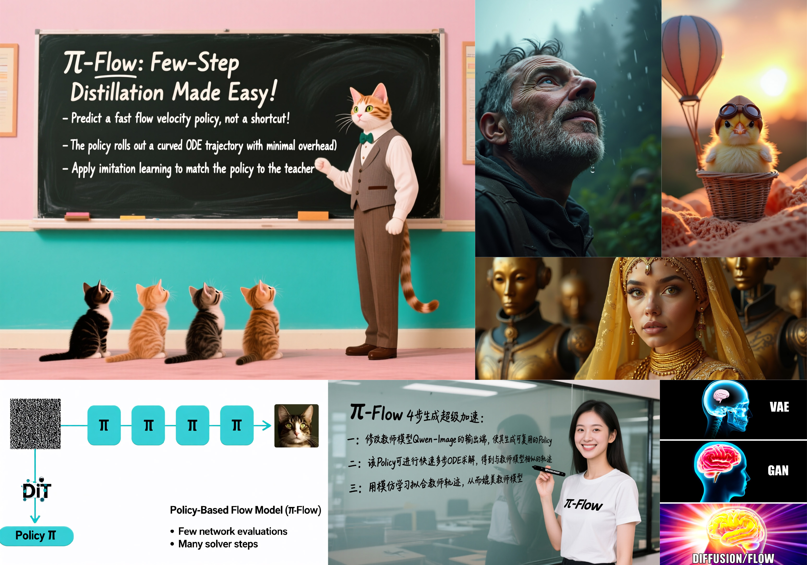
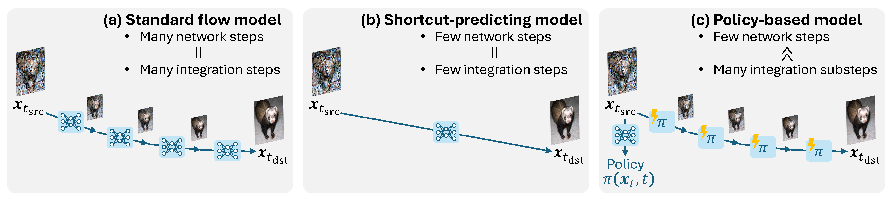
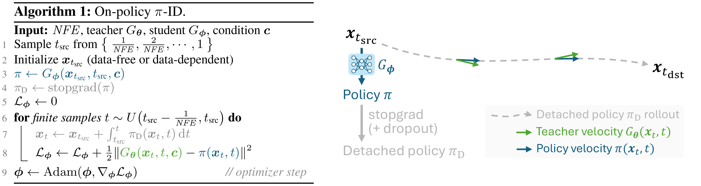
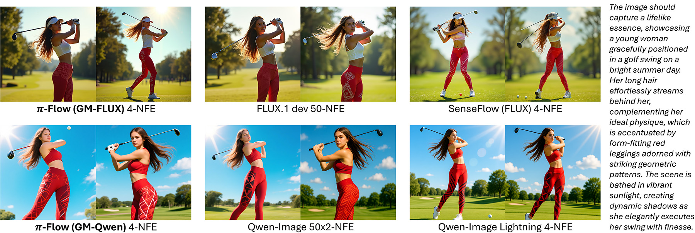
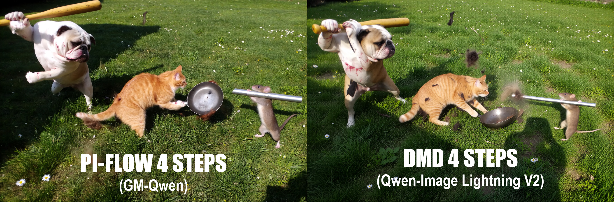
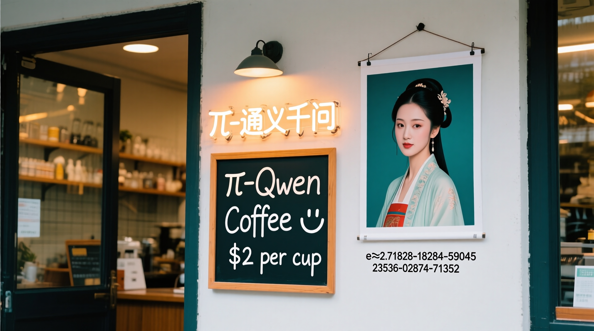
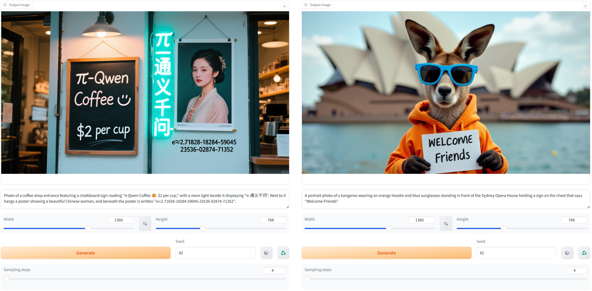
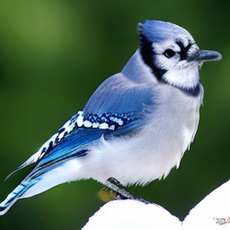
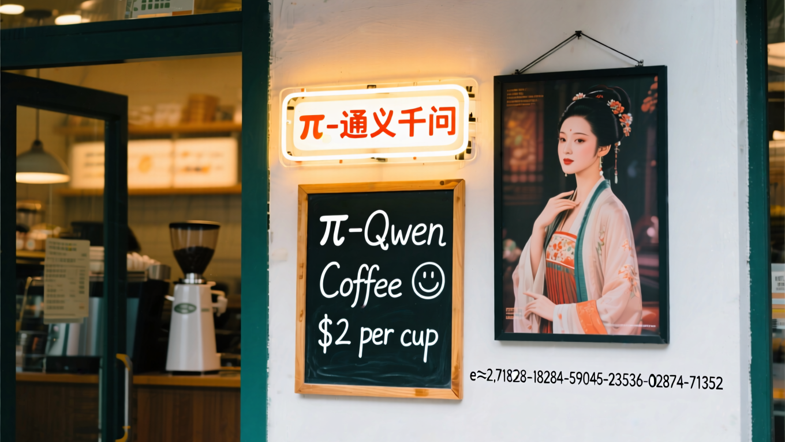

# pi-Flow: Policy-Based Flow Models

Official PyTorch implementation of the paper:

**pi-Flow: Policy-Based Few-Step Generation via Imitation Distillation**
<br>
In ICLR 2026
<br>
[Hansheng Chen](https://lakonik.github.io/)<sup>1</sup>, 
[Kai Zhang](https://kai-46.github.io/website/)<sup>2</sup>,
[Hao Tan](https://research.adobe.com/person/hao-tan/)<sup>2</sup>,
[Leonidas Guibas](https://geometry.stanford.edu/?member=guibas)<sup>1</sup>,
[Gordon Wetzstein](http://web.stanford.edu/~gordonwz/)<sup>1</sup>, 
[Sai Bi](https://sai-bi.github.io/)<sup>2</sup><br>
<sup>1</sup>Stanford University, <sup>2</sup>Adobe Research
<br>
[arXiv](https://arxiv.org/abs/2510.14974) | [ComfyUI](https://github.com/Lakonik/ComfyUI-piFlow) | [pi-Qwen Demo🤗](https://huggingface.co/spaces/Lakonik/pi-Qwen) | [pi-FLUX Demo🤗](https://huggingface.co/spaces/Lakonik/pi-FLUX.1) | [pi-FLUX.2 Demo🤗](https://huggingface.co/spaces/Lakonik/pi-FLUX.2)




## Highlights

- **Novel Framework**: pi-Flow stands for policy-based flow models. The network does not output a denoised state; instead, it outputs a fast policy that rolls out multiple ODE substeps to reach the denoised state.

  

- **Simple Distillation**: pi-Flow adopts policy-based imitation distillation (pi-ID). No JVPs, no auxiliary networks, no GANs—just a single L2 loss between the policy and the teacher.

  
 
- **Diversity and Teacher Alignment**: pi-Flow mitigates the quality–diversity trade-off, generating highly diverse samples while maintaining high quality. It also remains highly faithful to the teacher’s style. The example below shows that pi-Flow samples generally align with the teacher’s outputs and exhibit significantly higher diversity than those from DMD students (e.g., [SenseFlow](https://github.com/XingtongGe/SenseFlow), [Qwen-Image Lightning](https://github.com/ModelTC/Qwen-Image-Lightning)).

  

- **Texture Details**: pi-Flow excels in generating fine-grained texture details. When using additional photorealistic style LoRAs, this advantage becomes very prominent, as shown in the comparison below (zoom in for best view).

  

- **Scalability**: pi-Flow scales from ImageNet DiT to 20-billion-parameter text-to-image models (Qwen-Image). This codebase is highly optimized for large-scale experiments. See the [Codebase](#codebase) section for details.

## Installation

Follow the instructions in the [root README](../README.md#installation) to set up the environment and install LakonLab.

## Inference: Diffusers Pipelines

We provide diffusers pipelines for easy inference. The following code demonstrates how to sample images from the distilled Qwen-Image and FLUX models.

### [4-NFE GM-Qwen (GMFlow Policy)](../demo/example_gmqwen_pipeline.py)
Note: GM-Qwen supports elastic inference. Feel free to set `num_inference_steps` to any value above 4.

```python
import torch
from lakonlab.models.diffusions.schedulers import FlowMapSDEScheduler
from lakonlab.pipelines.pipeline_piqwen import PiQwenImagePipeline

pipe = PiQwenImagePipeline.from_pretrained(
    'Qwen/Qwen-Image',
    torch_dtype=torch.bfloat16)
adapter_name = pipe.load_lakonlab_adapter(  # you may later call `pipe.set_adapters([adapter_name, ...])` to combine other adapters (e.g., style LoRAs)
    'Lakonik/pi-Qwen-Image',
    subfolder='gmqwen_k8_piid_4step',
    target_module_name='transformer')
pipe.scheduler = FlowMapSDEScheduler.from_config(  # use fixed shift=3.2
    pipe.scheduler.config, shift=3.2, use_dynamic_shifting=False, final_step_size_scale=0.5)
pipe = pipe.to('cuda')

out = pipe(
    prompt='Photo of a coffee shop entrance featuring a chalkboard sign reading "π-Qwen Coffee 😊 $2 per cup," with a neon '
           'light beside it displaying "π-通义千问". Next to it hangs a poster showing a beautiful Chinese woman, '
           'and beneath the poster is written "e≈2.71828-18284-59045-23536-02874-71352".',
    width=1920,
    height=1080,
    num_inference_steps=4,
    generator=torch.Generator().manual_seed(42),
).images[0]
out.save('gmqwen_4nfe.png')
```


### [4-NFE GM-FLUX (GMFlow Policy)](../demo/example_gmflux_pipeline.py)
Note: For the 8-NFE version, replace `gmflux_k8_piid_4step` with `gmflux_k8_piid_8step` and set `num_inference_steps=8`.

```python
import torch
from lakonlab.models.diffusions.schedulers import FlowMapSDEScheduler
from lakonlab.pipelines.pipeline_piflux import PiFluxPipeline

pipe = PiFluxPipeline.from_pretrained(
    'black-forest-labs/FLUX.1-dev',
    torch_dtype=torch.bfloat16)
adapter_name = pipe.load_lakonlab_adapter(  # you may later call `pipe.set_adapters([adapter_name, ...])` to combine other adapters (e.g., style LoRAs)
    'Lakonik/pi-FLUX.1',
    subfolder='gmflux_k8_piid_4step',
    target_module_name='transformer')
pipe.scheduler = FlowMapSDEScheduler.from_config(  # use fixed shift=3.2
    pipe.scheduler.config, shift=3.2, use_dynamic_shifting=False, final_step_size_scale=0.5)
pipe = pipe.to('cuda')

out = pipe(
    prompt='A portrait photo of a kangaroo wearing an orange hoodie and blue sunglasses standing in front of the Sydney Opera House holding a sign on the chest that says "Welcome Friends"',
    width=1360,
    height=768,
    num_inference_steps=4,
    generator=torch.Generator().manual_seed(42),
).images[0]
out.save('gmflux_4nfe.png')
```


### 4-NFE DX-Qwen and DX-FLUX (DX Policy)

See [example_dxqwen_pipeline.py](../demo/example_dxqwen_pipeline.py) and [example_dxflux_pipeline.py](../demo/example_dxflux_pipeline.py) for examples of using the DX policy.

### 4-NFE GM-FLUX.2 (GMFlow Policy)

See [example_gmflux2_pipeline.py](../demo/example_gmflux2_pipeline.py) for an example of pi-FLUX.2 inference.

Note: GM-FLUX.2 also supports elastic inference. Feel free to set `num_inference_steps` to any value above 4.

## Inference: Gradio Apps

We provide Gradio apps for interactive inference with the distilled GM-Qwen and GM-FLUX models. 
Official apps are available on HuggingFace Spaces: [pi-Qwen Demo🤗](https://huggingface.co/spaces/Lakonik/pi-Qwen) | [pi-FLUX Demo🤗](https://huggingface.co/spaces/Lakonik/pi-FLUX.1) | [pi-FLUX.2 Demo🤗](https://huggingface.co/spaces/Lakonik/pi-FLUX.2).

Run the following commands to launch the apps locally:

```bash
python demo/gradio_gmqwen.py --share  # GM-Qwen elastic inference
```
```bash
python demo/gradio_gmflux.py --share  # GM-FLUX 4-NFE and 8-NFE inference
```
```bash
python demo/gradio_gmflux2.py --share  # GM-FLUX.2 elastic inference for image generation and editing
```



## Toy Models
To aid understanding, we provide minimal toy model training scripts that overfit the teacher behavior on a fixed initial noise using a static GMFlow policy (without student network). 

Run the following command to distill a toy model from a ImageNet DiT (REPA):
```bash
python demo/train_piflow_dit_imagenet_toymodel.py
```


Run the following command to distill a toy model from Qwen-Image (requires 40GB VRAM):
```bash
python demo/train_piflow_qwen_toymodel.py
```


The results of these toy models demonstrate the expressiveness of the GMFlow policy—a GMFlow policy with 32 components can fit the entire ODE trajectory from $t=1$ to $t=0$, making it theoretically possible for 1-NFE generation. In practice, the bottleneck is often the student network, not the policy itself, thus more NFEs are still needed.

## Training and Evaluation

Follow the instructions in the following links to reproduce the main results in the paper:
- [Distilling ImageNet DiT](../configs/piflow_imagenet/README.md)
- [Distilling Qwen-Image](../configs/piqwen/README.md)
- [Distilling FLUX](../configs/piflux/README.md)

By default, checkpoints will be saved into [checkpoints/](../checkpoints/), logs will be saved into [work_dirs/](../work_dirs/), and sampled images will be saved into [viz/](../viz/). These directories can be changed by modifying the config file (AWS S3 URLs are supported).
If existing checkpoints are found, training will automatically resume from the latest checkpoint. The training logs can be plotted using Tensorboard. Run the following command to start Tensorboard:
```bash
tensorboard --logdir work_dirs/
```

To use Wandb logging, please export your authentication key to the `WANDB_API_KEY` environment variable, and then enable Wandb logging by appending the following code to the `hooks` list in the `log_config` part of the config file:
```python
dict(
    type='WandbLoggerHook',
    init_kwargs=dict(project='PiFlow'),  # init_kwargs are passed to wandb.init()
)
```

To export a model checkpoint to diffusers safetensors for inference, run the following command after training:
```bash
python tools/export_piflow_to_diffusers.py <PATH_TO_CONFIG> --ckpt <PATH_TO_CKPT> --out-dir <OUTPUT_DIR>
```

## Essential Code

- Training
    - [train_piflow_dit_imagenet_toymodel.py](../demo/train_piflow_dit_imagenet_toymodel.py) and [train_piflow_qwen_toymodel.py](../demo/train_piflow_qwen_toymodel.py): Toy model distillation scripts with self-contained training loops.
    - [piflow.py](../lakonlab/models/diffusions/piflow.py): The `forward_train` method contains the full training loop.
- Inference
    - [pipeline_piqwen.py](../lakonlab/pipelines/pipeline_piqwen.py), [pipeline_piflux.py](../lakonlab/pipelines/pipeline_piflux.py), and [pipeline_piflux2.py](../lakonlab/pipelines/pipeline_piflux2.py): Full sampling code in the style of Diffusers.
    - [piflow.py](../lakonlab/models/diffusions/piflow.py): The `forward_test` method contains the same full sampling loop.
- Policies 
    - [gmflow.py](../lakonlab/models/diffusions/piflow_policies/gmflow.py): GMFlow policy.
    - [dx.py](../lakonlab/models/diffusions/piflow_policies/dx.py): DX policy.
- Networks
    - [gmflow](../lakonlab/models/architectures/gmflow) and [dxflow](../lakonlab/models/architectures/dxflow): Student networks with modified output layers to predict the flow policy.

## Citation
```
@article{piflow,
  title={pi-Flow: Policy-Based Few-Step Generation via Imitation Distillation}, 
  author={Hansheng Chen and Kai Zhang and Hao Tan and Leonidas Guibas and Gordon Wetzstein and Sai Bi},
  url={https://arxiv.org/abs/2510.14974}, 
  journal={arXiv preprint arXiv:2510.14974},
  year={2025},
}

@article{gmflow,
  title={Gaussian Mixture Flow Matching Models},
  author={Hansheng Chen and Kai Zhang and Hao Tan and Zexiang Xu and Fujun Luan and Leonidas Guibas and Gordon Wetzstein and Sai Bi},
  url={https://arxiv.org/abs/2504.05304}, 
  journal={arXiv preprint arXiv:2504.05304},
  year={2025},
}
```
